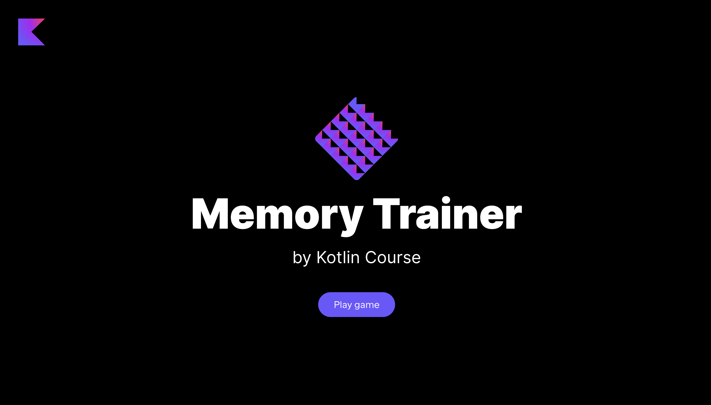

At each stage, you can run the current version of the application. 
However, if some functionality has not been implemented yet, 
some buttons may not work and some information may not be displayed.

To run the application, you need to run the `main` function inside 
the [MemoryTrainerApplication.kt](./src/main/kotlin/jetbrains/kotlin/course/card/trainer/MemoryTrainerApplication.kt) file:

Please don't forget to _stop all other runs_ by pressing the square red button:

Next, you need to open any browser (we recommend using [Google Chrome](https://www.google.com/chrome/) to display the elements as in the examples) 
and open http://localhost:8080/. You will see the main page of the application.

If a game from a previous launch is displayed on the screen when starting the game, you need to reset the caches.
This can usually be done with a keyboard shortcut: `ctrl` + `shift` + `R` (`command` + `shift` + `R` for macOS).

